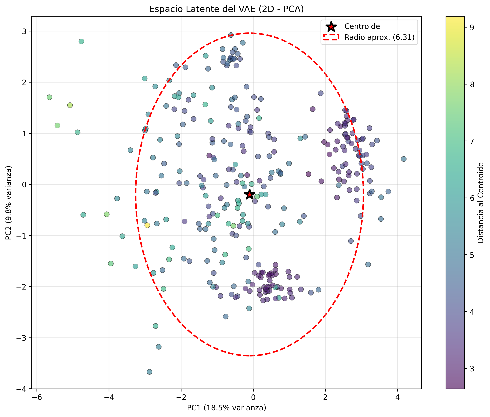
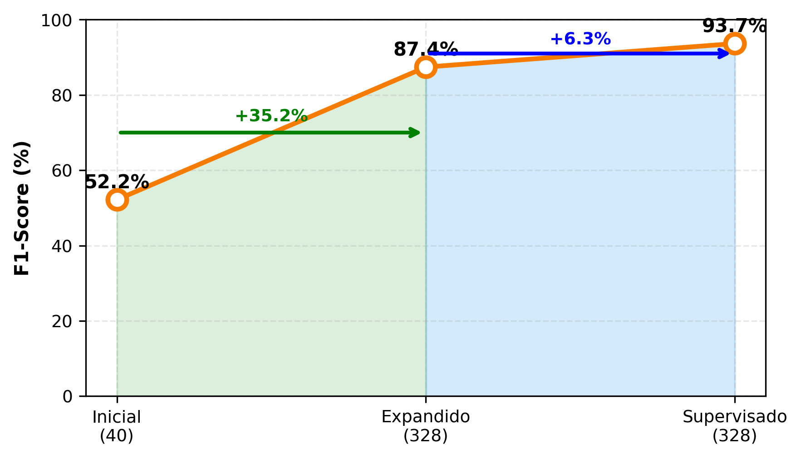
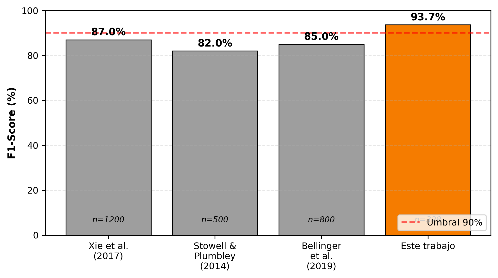

# 🐸 Frog Vocalization Detection using VAE

[](https://opensource.org/licenses/MIT)
[](https://www.python.org/downloads/)
[](https://pytorch.org/)

Sistema de detección automática de vocalizaciones de ranas utilizando Variational Autoencoders (VAE) y clasificación supervisada.

## 📊 Resultados

| Modelo | Recall | Precisión | F1-Score |
|--------|--------|-----------|----------|
| VAE (40 muestras) | 90.00% | 36.73% | 52.17% |
| VAE (328 muestras) | 90.43% | 84.57% | 87.40% |
| **VAE + Clasificador** | **92.41%** | **94.92%** | **93.65%** ✨ |

## 🏗️ Arquitectura

El sistema combina dos enfoques:

1. **VAE (Variational Autoencoder):** Compresión no supervisada del espectrograma a espacio latente de 16 dimensiones
2. **Clasificador MLP:** Red neuronal supervisada para clasificación binaria (rana/no-rana)
```
Audio → Mel-Spectrogram → VAE Encoder → Espacio Latente (16D) → MLP → Predicción
```

## 🚀 Instalación

### Requisitos

- Python 3.8+
- PyTorch 2.0+
- librosa
- numpy
- matplotlib
- scikit-learn

### Instalación rápida
```bash
# Clonar repositorio
git clone https://github.com/robleaustral/frog-vae-detector.git
cd frog-vae-detector

# Crear entorno virtual
python -m venv venv
source venv/bin/activate  # En Windows: venv\Scripts\activate

# Instalar dependencias
pip install -r requirements.txt
```

## 📦 Estructura del Proyecto
```
frog-vae-detector/
├── models/
│   ├── vae_model.py          # Arquitectura del VAE
│   ├── audio_processor.py    # Preprocesamiento de audio
│   └── detector.py            # Sistema de detección
├── scripts/
│   ├── train_vae.py          # Entrenamiento del VAE
│   ├── train_classifier.py   # Entrenamiento del clasificador
│   ├── evaluate_model.py     # Evaluación de modelos
│   └── visualize_latent_space.py  # Visualizaciones
├── notebooks/
│   └── evaluation_notebook.ipynb  # Análisis interactivo
├── figures/                   # Figuras del paper
├── results/                   # Métricas y resultados
├── requirements.txt
└── README.md
```

## 🎯 Uso Rápido

### 1. Preprocesar Audio
```bash
python audio_preprocessor.py \
  -i ./data/raw \
  -o ./data/processed
```

### 2. Entrenar VAE
```bash
python scripts/train_vae.py \
  --data-dir ./data/processed \
  --output-dir ./trained_models \
  --epochs 100 \
  --latent-dim 16
```

### 3. Entrenar Clasificador
```bash
python scripts/train_classifier.py
```

### 4. Evaluar
```bash
python scripts/evaluate_model.py \
  --model-path ./trained_models/best_model.pth \
  --config-path ./trained_models/detector_config.json \
  --frog-data ./data/processed \
  --non-frog-data ./data/other_sounds_processed
```

## 📊 Dataset

El sistema fue evaluado con:

- **Ranas:** 328 segmentos de 5 segundos
  - 40 del dataset ESC-50
  - 288 de grabaciones de campo (12 audios de ~60 seg c/u)
- **No-ranas:** 120 segmentos (perros, gatos, aves del ESC-50)

## 🔬 Metodología

### VAE (Variational Autoencoder)

- **Encoder:** Capas convolucionales que comprimen espectrograma (128×216) a 16 dimensiones
- **Decoder:** Reconstruye el espectrograma original
- **Detección:** Distancia euclidiana al centroide del espacio latente

### Clasificador Supervisado

- **Arquitectura:** MLP (16 → 32 → 16 → 1)
- **Regularización:** Dropout 30%
- **Optimizador:** Adam (lr=0.001)
- **Función de pérdida:** Binary Cross-Entropy

## 📈 Visualizaciones

### Espacio Latente (PCA)



### Evolución del F1-Score



### Comparación con Estado del Arte



## 📄 Citación

Si utilizas este código en tu investigación, por favor cita:
```bibtex
@article{frog_vae_2025,
  title={Efficient Frog Vocalization Detection using Variational Autoencoders},
  author={Luis Veas-Castillo},
  journal={[JOURNAL]},
  year={2025}
}
```

## 🤝 Contribuciones

Las contribuciones son bienvenidas. Por favor:

1. Fork el proyecto
2. Crea una rama para tu feature (`git checkout -b feature/AmazingFeature`)
3. Commit tus cambios (`git commit -m 'Add some AmazingFeature'`)
4. Push a la rama (`git push origin feature/AmazingFeature`)
5. Abre un Pull Request

## 📝 Licencia

Este proyecto está bajo la Licencia MIT - ver el archivo [LICENSE](LICENSE) para detalles.

## 👥 Autores

- **Luis Veas-Castillo** - *Trabajo inicial* - [GitHub](https://github.com/robleaustral)

## 🙏 Agradecimientos

- Dataset ESC-50: Karol J. Piczak
- Comunidad de PyTorch
- [Otras instituciones/personas]

## 📧 Contacto

Para preguntas o colaboraciones: [luis.veasc@inf.uach.cl]

---

**Roble Austral Organization** - [GitHub](https://github.com/robleaustral)

## 👤 Autor

**Luis Veas-Castillo**
- Instituto de Informática
- Universidad Austral de Chile
- Valdivia, Chile
- 📧 luis.veasc@inf.uach.cl
